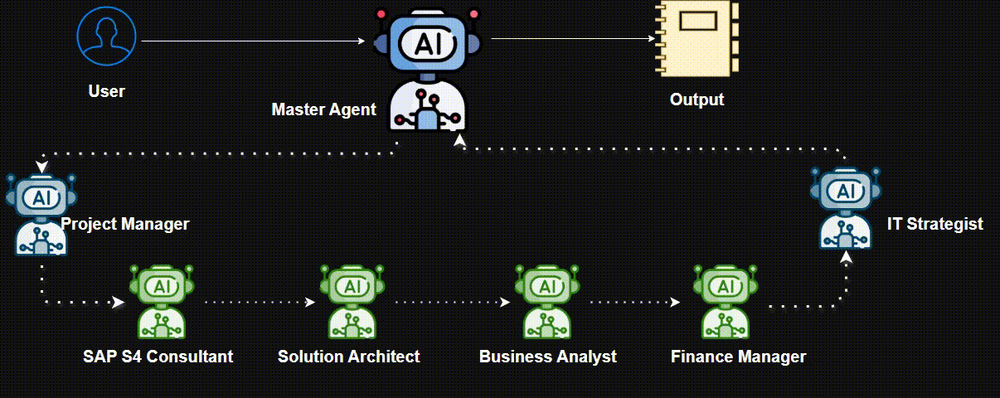

# Agentic AI Orchestration for Strategic Group Chat

<p align="center">
  
</p>

## Overview
This project demonstrates an agentic AI orchestration system for strategic group discussions using multiple specialized agents. It leverages Azure OpenAI and the Semantic Kernel library to simulate a collaborative debate among domain experts, each represented as an autonomous agent. The orchestration is visualized through a Streamlit web interface.


## Key Features
- **Multiple AI Agents:** Each agent represents a specific role (Project Manager, SAP S/4HANA Consultant, Solution Architect, Business Analyst, Finance Manager, IT Strategic Leader) with unique instructions and expertise.
- **Group Chat Orchestration:** Agents interact in a structured group chat, managed by a custom group chat manager that guides the discussion, selects speakers, and determines when the conversation should end.
- **Azure OpenAI Integration:** Uses Azure OpenAI for agent responses, enabling advanced language understanding and reasoning.
- **Streamlit UI:** Provides an interactive web interface for users to input tasks, configure Azure settings, and view the evolving group conversation in real time.

## How It Works
1. **Configuration:**
   - Users enter Azure OpenAI deployment details (deployment name, API key, endpoint) in the sidebar.
   - Users specify a strategic task or question for the group to discuss.

2. **Agent Setup:**
   - The system creates six agents, each with a domain-specific role and instructions.
   - Agents are powered by Azure OpenAI and Semantic Kernel's agent abstractions.

3. **Orchestration:**
   - A custom `ChatCompletionGroupChatManager` manages the group chat, ensuring all agents participate, selecting the next speaker, and determining when the discussion is complete.
   - The manager uses prompt templates to guide agent behavior and conversation flow.

4. **Execution:**
   - When the user clicks "Run the analysis," the system starts the orchestration asynchronously.
   - Agents take turns responding to the task, with their messages animated in the UI.
   - The manager monitors the discussion, summarizes results, and provides a final output.

5. **Results:**
   - The full conversation is displayed in the Streamlit app.
   - A final summary and result are presented at the end.

## Example Use Case
- **SAP Master Data Hub Discussion:**
  - The default task asks agents to debate the onboarding of SAP Master Data Integration for a global master data hub.
  - Each agent contributes insights from their domain, leading to a comprehensive, multi-perspective analysis.

## Installation & Usage
1. **Install Dependencies:**
   ```powershell
   pip install -r requirements.txt
   ```
2. **Run the App:**
   ```powershell
   streamlit run agenticdebate.py
   ```
3. **Configure Azure OpenAI:**
   - Enter your Azure deployment name, API key, and endpoint in the sidebar.
4. **Start a Discussion:**
   - Enter your strategic question or task and click "Run the analysis" to begin the group chat.

## File Structure
- `agenticdebate.py`: Main application code, including agent definitions, orchestration logic, and Streamlit UI.
- `requirements.txt`: Python dependencies.
- `README.md`: Project documentation.

## Customization
- **Add/Modify Agents:**
  - Edit the `get_agents` function in `agenticdebate.py` to add new roles or change agent instructions.
- **Change Prompts:**
  - Update prompt templates in the `ChatCompletionGroupChatManager` class to adjust discussion flow or output style.
## Possible use cases

---

## 🌟 Possible Use Cases

Explore how agentic AI orchestration can address real-world business challenges across departments:

### 📈 Marketing
| Problem | Agents Involved | Focus |
|---|---|---|
| How can we improve customer engagement across digital channels? | Marketing Strategist, Data Analyst, Solution Architect, IT Leader | Customer segmentation, campaign automation, personalization using AI tools |
| What’s the ROI of our current ad spend across platforms? | Marketing Strategist, Finance Manager, Data Analyst | Attribution modeling, budget optimization, dashboarding |

### 👥 Human Resources (HR)
| Problem | Agents Involved | Focus |
|---|---|---|
| How can we reduce employee turnover in key departments? | HR Manager, Data Analyst, Finance Manager, IT Leader | Attrition analysis, employee engagement, compensation benchmarking |
| What’s the best way to automate our onboarding process? | HR Manager, IT Leader, Solution Architect | Workflow automation, document management, compliance tracking |

### 💼 Sales
| Problem | Agents Involved | Focus |
|---|---|---|
| Why is our sales conversion rate dropping in Q3? | Sales Manager, Business Analyst, CRM Consultant, Finance Manager | Funnel analysis, lead quality, sales rep performance, pricing strategy |
| How can we streamline our quote-to-cash process? | Sales Manager, Solution Architect, CRM Consultant | Integration between CRM, ERP, and billing systems |

### 💰 Finance
| Problem | Agents Involved | Focus |
|---|---|---|
| How can we improve cash flow forecasting accuracy? | Finance Manager, SAP Consultant, Business Analyst | Real-time data integration, predictive modeling, scenario planning |
| Are we compliant with the latest tax regulations in all operating regions? | Finance Manager, SAP Consultant | Regulatory updates, system configuration, audit trails |

### 🏢 Operations
| Problem | Agents Involved | Focus |
|---|---|---|
| How can we reduce supply chain disruptions? | Supply Chain Manager, SAP Consultant, Solution Architect | Inventory visibility, supplier risk scoring, demand forecasting |
| What’s causing delays in our production line? | Operations Manager, Data Analyst, Solution Architect | IoT data analysis, root cause detection, process optimization |

---


## Technologies Used
- Python
- Streamlit
- Semantic Kernel
- Azure OpenAI

## License
This project is provided for educational and demonstration purposes.
